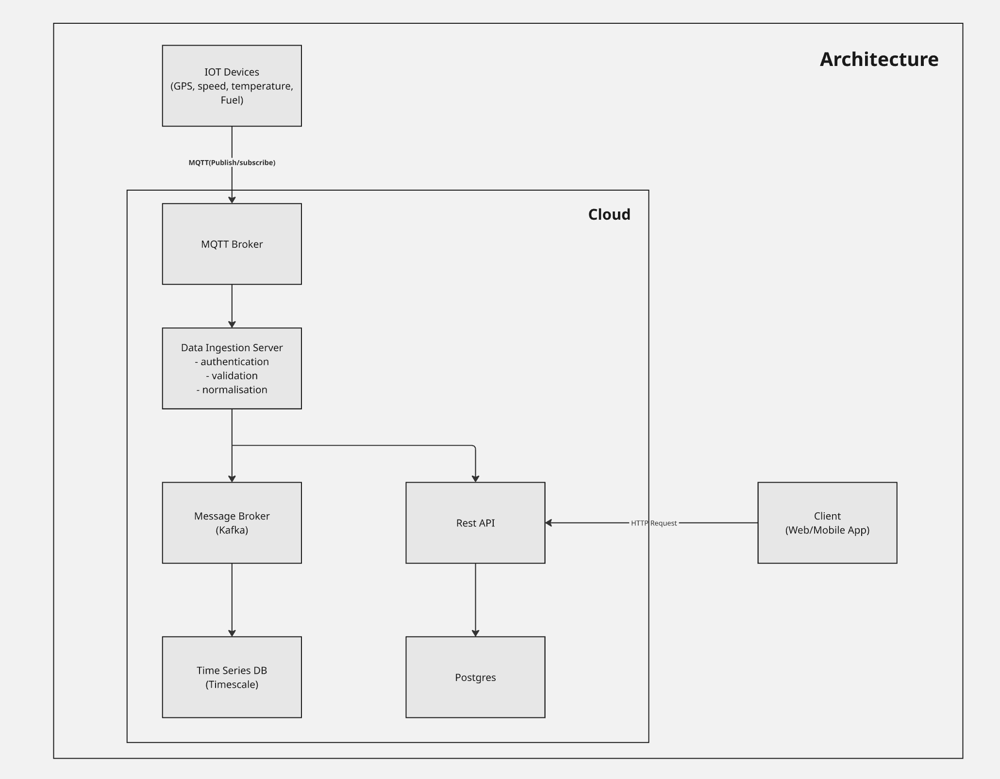
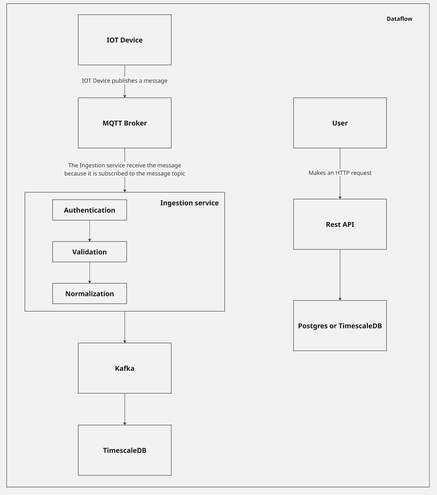

# API Design

## 1 - Create an architecture diagram covering edge devices, connectivity, cloud, etc



## 2 - Dataflow



## 3 - 5 Rest APIs for tracking location, sensors, etc

<details>
<summary>Add a new vehicle</summary>
<br>

**Endpoint**

```js
[POST] /v1/vehicles
```

**Payload**

```json
{
    deviceId: "device-123",
    plate: "AA-00-BB",
    year: 2026,
    brand: "renault"
}
```

</details>

<br>

<details>
<summary>Get the vehicle locations history by vehicle id</summary>
<br>

**Endpoint**

```js
[GET] /v1/vehicles/{vehicle_id}/locations?page=1&per_page=20&from=2026-08-13T00:00:00Z&to=2026-08-13T23:59:59Z
```

</details>
<br>

<details>
<summary>Get the vehicle locations history by vehicle id</summary>
<br>

**Endpoint**

```js
[GET] /v1/vehicles/{vehicle_id}/locations?page=1&per_page=20&from=2026-08-13T00:00:00Z&to=2026-08-13T23:59:59Z
```

</details>

<br>

<details>
<summary>Create a geofence</summary>
<br>

**Endpoint**

```js
[POST] /api/v1/geofences
```

**Payload**

```json
{
    name: "Braga",
    center: {
        latitude: 41.5515751,
        longitude: -8.423381
    },
    radius: 3000 // in meters
}
```

</details>

<br>

<details>
<summary>Add new data from the vehicle sensors</summary>

<br>

**Endpoint**

```js
[POST] /api/v1/ingest
```

**Payload**

```json
[{
    collected_at: "2026-08-13T23:59:59Z",
    latitude: 41.5515751,
    longitude: -8.423381,
    speed: {
        value: 120,
        longitude: "unit"
    },
    fuel: {
        value: 10,
        longitude: "liters"
    },
    engine_temperature: {
        value: 86,
        longitude: "Celcius"
    }
}]
```

</details>

<br>

<details>
<summary>Get the geofences where a vehicle has been</summary>

<br>

**Endpoint**

```js
[POST] /api/v1/ingest
```

**Payload**

```json
[{
    collected_at: "2026-08-13T23:59:59Z",
    latitude: 41.5515751,
    longitude: -8.423381,
    speed: {
        value: 120,
        longitude: "unit"
    },
    fuel: {
        value: 10,
        longitude: "liters"
    },
    engine_temperature: {
        value: 86,
        longitude: "Celcius"
    }
}]
```

</details>

<br>

<details>
<summary>Remove a vehicle from riding in a specific area</summary>

<br>

**Endpoint**

```js
[DELETE] /api/v1/vehicles/{vehicle_id}/geofences/{geofence_id}
```

</details>

## 4 - API documentation and testing strategy

<details>
<summary>API Documentation</summary>

For the API documentation, I would use the OpenAPI specification to document all REST endpoints, including request and response schemas, authentication requirements, possible HTTP status codes, and example payloads.

I would also provide a README explaining how to run the project locally, the overall API structure, required environment variables, and the main architectural decisions.

</details>

<details>
<summary>Testing</summary>

The testing strategy would follow the following concepts:

- **Unit tests** will cover isolated business logic such as validation, normalization, authentication/authorization and geofencing rules.

- **Integration tests** will verify the interaction between application components and infrastructure dependencies. PostgreSQL, Kafka and MQTT will be provided through Docker containers, allowing us to test persistence, message publishing and consumption using realistic infrastructure.

- **End-to-end tests** will cover the main critical flows from an IoT device to data persistence. A simulated telemetry message will be publisehd to the MQTT broker, which will be processed by the ingestion service, published to Kafka, consumed and persisted in TimescaleDB. The test will then verify the persisted data. This allows the complete ingestion pipeline to be tested without requiring physical IoT hardware.

</details>
